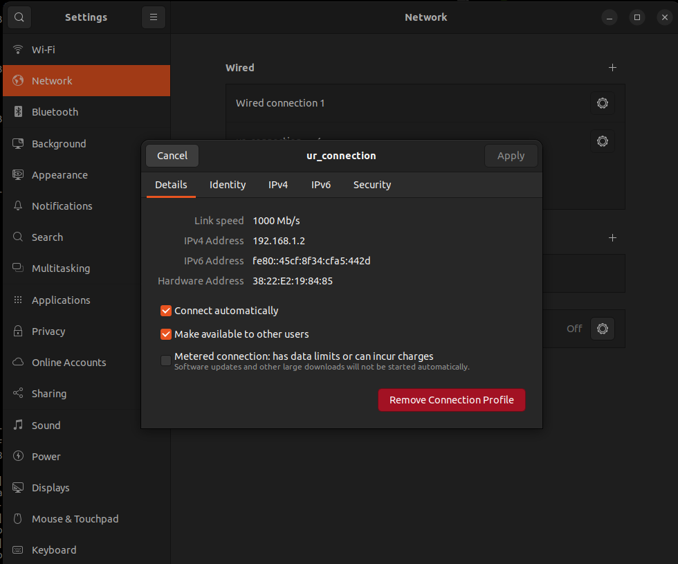
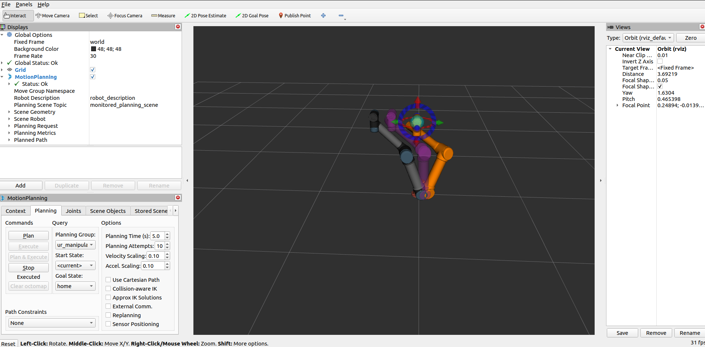

# UR5 Learning Nuggets

This repository is a ROS 2 package that contains learning nuggets for UR5.

* [Nugget 1](#nugget-1): setup instructions for ROS humble, UR5, success criteria: MoveIt GUI with UR5 changing a few poses on both fake driver and real robot
* [Nugget 2](#nugget-2): setup instructions for gripper: success; MoveIt GUI (or something else) to open and close the gripper (simulation + hardware)
* [Nugget 3](#nugget-3): using a simple coding example to move the robot using MoveIt
* [Nugget 4](#nugget-4): using a simple coding example to opening/closing the gripper


## Prerequisites
 * [Moveit](https://moveit.ros.org/install-moveit2/binary/)
 * [Universal Robots ROS2 Driver](https://github.com/UniversalRobots/Universal_Robots_ROS2_Driver.git)
(does not work right now) 

## **Nugget 1** 
(setup instructions for ROS humble, UR5, success criteria: MoveIt GUI with UR5 changing a few poses on both fake driver and real robot)
### 1. Setup network connection
<br>

### 2. Launch UR5 controller and moveit config

<br>**For work with fake hardware:**

```bash
ros2 launch ur_robot_driver ur_control.launch.py ur_type:=ur5 robot_ip:=xxx.xxx.x.xxx use_fake_hardware:=true initial_joint_controller:=joint_trajectory_controller launch_rviz:=false
```
```bash
ros2 launch ur_moveit_config ur_moveit.launch.py ur_type:=ur5 use_fake_hardware:=true launch_rviz:=true
```
<br>**For work with real robot:**

```bash
ros2 launch ur_robot_driver ur_control.launch.py ur_type:=ur5 robot_ip:=xxx.xxx.x.xxx use_fake_hardware:=false launch_rviz:=false
```
```bash
ros2 launch ur_moveit_config ur_moveit.launch.py ur_type:=ur5 use_fake_hardware:=false launch_rviz:=true
```
### 3. If working with real robot start external_control program at teach pendant

### 4. Plan and execute
<br>Fake hardware:
<br>

## **Nugget 3**
(using a simple coding example to move the robot using MoveIt)
### 1. Clone this package to the workspace and build
```bash
git clone https://github.com/patsyuk03/ur5_example.git
colcon build --packages-select ur5_example
source install/setup.bash
```
### 2. Launch PnP demo
<br>**For work with fake hardware:** 

```bash
ros2 launch ur5_example ur5.launch.py 
```
```bash
ros2 launch ur5_example pnp_node.launch.py 
```
<br>**For work with real robot:**

```bash
ros2 launch ur5_example ur5.launch.py robot_ip:=xxx.xxx.x.xxx use_fake_hardware:=false
```
Start external_control program at teach pendant

```bash
ros2 launch ur5_example pnp_node.launch.py 
```


## Video
[Fake UR5 Demo](https://drive.google.com/file/d/1nLHYhd_WZ5f-bM-RubpxMBOtdzch6dja/view?usp=sharing)
<br>[Real UR5 Demo](https://drive.google.com/file/d/1WiFpZSDHNDPwOtFkNj7hlaCUSuZL0VnX/view?usp=sharing)